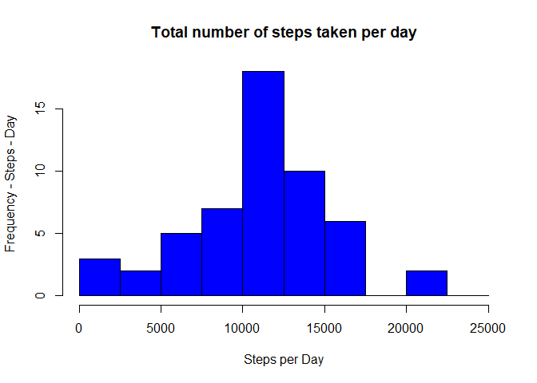
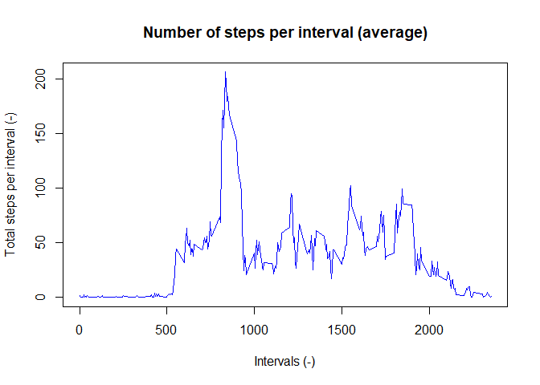
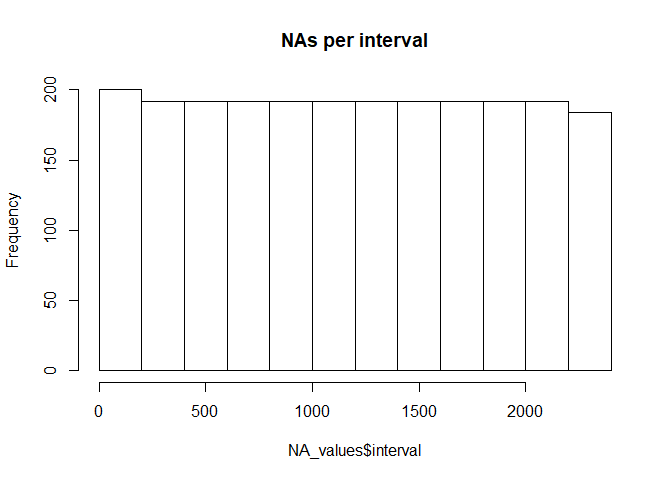
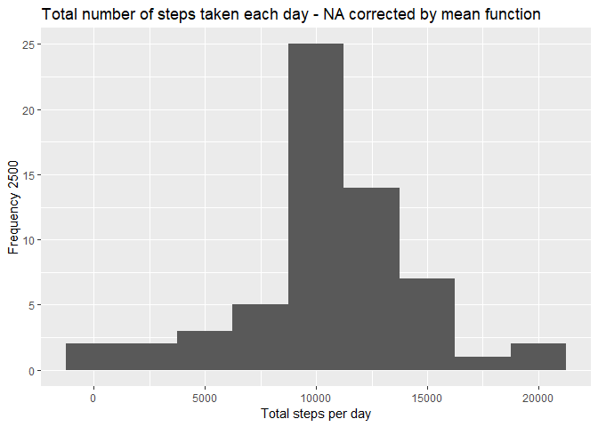
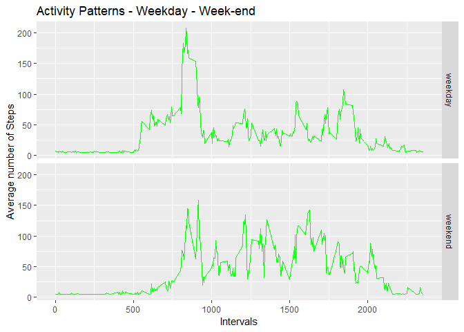

## Loading and preprocessing the data

```r
library(plyr)
library("data.table")
library(ggplot2)
```

```
## Registered S3 methods overwritten by 'ggplot2':
##   method         from 
##   [.quosures     rlang
##   c.quosures     rlang
##   print.quosures rlang
```

```r
library(Hmisc)
```

```
## Warning: package 'Hmisc' was built under R version 3.6.3
```

```
## Loading required package: lattice
```

```
## Loading required package: survival
```

```
## Warning: package 'survival' was built under R version 3.6.3
```

```
## Loading required package: Formula
```

```
## 
## Attaching package: 'Hmisc'
```

```
## The following objects are masked from 'package:plyr':
## 
##     is.discrete, summarize
```

```
## The following objects are masked from 'package:base':
## 
##     format.pval, units
```

```r
library(xtable)
```

```
## 
## Attaching package: 'xtable'
```

```
## The following objects are masked from 'package:Hmisc':
## 
##     label, label<-
```

```r
setwd("~/R_Coursera/R_Coursera_Cours4/RepData_PeerAssessment1")
DataFilename <- "activity.zip"
unzip(zipfile = DataFilename, exdir = "./mydata")
## Read all data
Raw_data<-data.table::fread("mydata/activity.csv")
head(Raw_data)
```

```
##    steps       date interval
## 1:    NA 2012-10-01        0
## 2:    NA 2012-10-01        5
## 3:    NA 2012-10-01       10
## 4:    NA 2012-10-01       15
## 5:    NA 2012-10-01       20
## 6:    NA 2012-10-01       25
```

## What is mean total number of steps taken per day?

```r
mean_steps_day <- aggregate(steps ~ date, data = Raw_data, FUN = sum, na.rm = TRUE)
head(mean_steps_day)
```

```
##         date steps
## 1 2012-10-02   126
## 2 2012-10-03 11352
## 3 2012-10-04 12116
## 4 2012-10-05 13294
## 5 2012-10-06 15420
## 6 2012-10-07 11015
```

```r
##a<-max(mean_steps_day$steps)
##print(a)
hist(mean_steps_day$steps, breaks=c(0,2500,5000,7500,10000,12500,15000, 17500, 20000, 22500, 25000), xlab = "Steps per Day", ylab="Frequency - Steps - Day", main = "Total number of steps taken per day", col = "blue")
```

<!-- -->

```r
qst1_mean<-mean(mean_steps_day$steps)
qst1_mean <- format(qst1_mean,digits=1)
qst1_median<-median(mean_steps_day$steps)
qst1_median <- format(qst1_median,digits=1)
##print(qst1_mean)
##print(qst1_median)
```
* Mean: 10766
* Median:  10765

## What is the average daily activity pattern?

```r
steps_mean <- aggregate(steps ~ interval, data = Raw_data, FUN = mean, na.rm = TRUE)
plot(steps_mean$interval, steps_mean$steps, type = "l", col = "blue", xlab = "Intervals (-)", ylab = "Total steps per interval (-)", main = "Number of steps per interval (average)")
```

<!-- -->

```r
max_steps <-max(steps_mean$steps)
max_interval <- steps_mean$interval[which(steps_mean$steps == max_steps)]
##min_steps<-min(steps_mean$steps)
##min_interval <- steps_mean$interval[which(steps_mean$steps == min_steps)]
print(max_steps)
```

```
## [1] 206.1698
```

```r
print(max_interval)
```

```
## [1] 835
```

```r
##print(min_steps)
##print(min_interval)
```
* Max number of steps: 206.1698113
* Interval where max number of steps:  835


## Imputing missing values

```r
a<-sum(is.na(Raw_data))
NA_values <- subset(Raw_data, is.na(steps))
##print(NA_values)
hist(NA_values$interval, main="NAs per interval")
```

<!-- -->

```r
Raw_Data_imputed <- Raw_data
Raw_Data_imputed$steps <- impute(Raw_data$steps, fun=mean)
##head(Raw_Data_imputed)
```
* Number of NA values: 2304

```r
steps_day_imp <- tapply(Raw_Data_imputed$steps, Raw_Data_imputed$date, sum)
qplot(steps_day_imp, xlab='Total steps per day', ylab='Frequency 2500', binwidth=2500, main = "Total number of steps taken each day - NA corrected by mean function")
```

<!-- -->

```r
new_mean<-mean(steps_day_imp)
new_mean <- format(new_mean,digits=1)
new_median<-median(steps_day_imp)
new_median <- format(new_median,digits=1)
##print(new_mean)
##print(new_median)
results_mean_median <- data.frame(c(qst1_mean, qst1_median), c(new_mean, new_median))
colnames(results_mean_median) <- c("NA removed", "Imputed NA values")
rownames(results_mean_median) <- c("mean", "median")
print(results_mean_median)
```

```
##        NA removed Imputed NA values
## mean        10766             10766
## median      10765             10766
```

* Imputing missing values did not change a lot the mean value or the median value.

## Are there differences in activity patterns between weekdays and weekends?

```r
Raw_Data_imputed$dayType <- ifelse(weekdays(as.Date(Raw_Data_imputed$date)) == "Saturday" | weekdays(as.Date(Raw_Data_imputed$date)) == "Sunday", "weekend", "weekday")
#transform dayType variable into factor
Raw_Data_imputed$dayType <- factor(Raw_Data_imputed$dayType)
average_Raw_Data_Imp <- aggregate(steps ~ interval + dayType, data=Raw_Data_imputed, mean)
##head(average_Raw_Data_Imp)
names(average_Raw_Data_Imp) <- c("Interval", "Day_type", "Mean_steps")
ggplot(average_Raw_Data_Imp, aes(Interval, Mean_steps)) + geom_line(color = "green") + facet_grid(Day_type~.) + labs(x = "Intervals", y = "Average number of Steps", title = "Activity Patterns - Weekday - Week-end")
```

<!-- -->

* It seems that the tested subjects have an earlier start in the week days. On weekends, the activity seems more spread between 8am and 8pm and slightly more important than in the week days.
